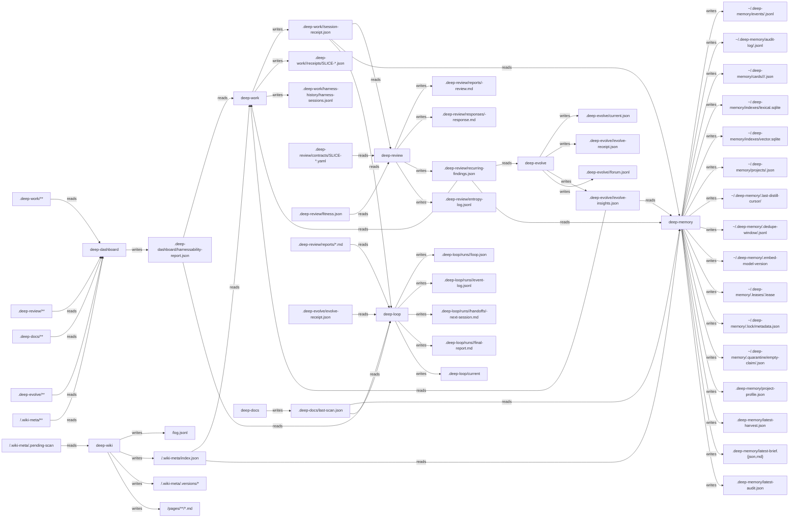

<!-- deep-suite:auto-generated:artifact-io-graph:start -->

# Cross-Plugin Artifact I/O Graph

**Auto-generated** by `scripts/generate-reference-sections.js`. Do not hand-edit.

Every `writes`/`reads` path declared in `.claude-plugin/suite-extensions.json` rendered as Mermaid. Reader/writer mismatch is a contract bug — `scripts/check-pinned-plugin-paths.js` verifies the pinned plugin source contains each path literal.

<!-- deep-suite:auto-generated:artifact-io-graph:end -->
