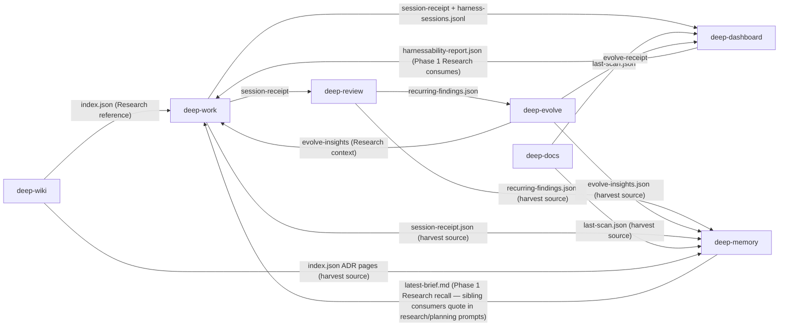

[English](./integrated-workflow-guide.md)

# Deep Suite 통합 워크플로우 가이드

이 가이드는 deep-suite의 통합 artifact 워크플로우에 참여하는 7개 플러그인이 Claude Code와 Codex에서 실제 프로젝트 중 **어떻게 함께 동작하는지** 설명한다. 개별 플러그인의 기능 목록이 아니라, 개발자 관점의 **통합 사용 흐름**에 초점을 맞춘다. (deep-goal 과 deep-loop 은 이 artifact 데이터 흐름의 참여자가 아니라 suite 의 goal-compiler·loop-orchestration 계층이므로 본 가이드의 curated 서브셋에서 제외한다.)

> 반영 버전: **deep-work v6.10.0**, **deep-review v1.13.0**, **deep-evolve v3.6.0**, **deep-docs v1.6.0**, **deep-wiki v1.8.0**, **deep-dashboard v1.5.0**, **deep-memory v1.0.4** — 7개 플러그인 모두 M3 공통 artifact envelope 을 채택 (cross-plugin `run_id` chain + `schemas/payload-registry/` 의 envelope-aware payload 검증). deep-dashboard v1.3.2 는 M5.5 수락 기준을 종결 — 마지막 M4-deferred metric `suite.tests.coverage_per_plugin` 을 활성화 (8-item M5.5 표준 테스트 카탈로그 대비 per-plugin distribution; dashboard-internal manifest 가 `docs/test-catalog.md` 1:1 mirror). 16개 metric 모두 M4-core (12 M3-baseline + 3 M5-activated handoff/compaction + 1 M5.5-activated test coverage). deep-work v6.6.1 + deep-evolve v3.3.0 은 M5.7 producer-side adoption 을 ship 하여 (handoff + compaction-state emit) 3개 M5-activated metric (handoff roundtrip + compaction frequency/preserved-ratio) 의 data-flow 를 완성. deep-work v6.6.2 는 M5.5 #7 을 closure — `phase-guard-core.js` non-implement dangerous-command denylist (5 family + `CLAUDE_ALLOW_<FAMILY>` override). M5.5 #3 hook golden test (deep-work v6.6.3 + deep-evolve v3.3.1 + deep-wiki v1.5.1) 과 M5.5 #5 stale-recovery test (deep-review v1.4.1 + deep-evolve v3.3.2 + deep-wiki v1.5.2) 가 hook IO 계약 + crash-recovery 의미론에 대한 regression-protection 갭을 종결. deep-work v6.6.3 은 §9 phase-guard hardening rollup (override-env composition + per-family override loop + scope-omission docblock) 도 ship. deep-review v1.4.2 는 M5.5 #5 ubuntu CI follow-up 을 종결 — `mutation-protocol.sh` 의 BSD-first `stat -f %m` 순서가 GNU stat 에서 mount-point 문자열을 반환해 `set -e` arithmetic 을 깬 latent 버그를 reverse (deep-work PR #27 BSD/GNU stat reverse-order 패턴 미러). deep-review v1.5.0 은 `/deep-review-loop` wrapper 를 추가 (review ↔ respond 를 메인 에이전트 종합 판단 — 자연 수렴 / `--max` / 정체-signature ≥50% 재출현 / 운영 오류 ≥2 / 사용자 중단 — 까지 자동 반복) + Codex per-call timeout 을 300s → 900s 로 상향; 그에 맞춰 `mutation-protocol.sh` 의 `REVIEW_TIMEOUT_SECONDS` 도 600s → 1200s 로 올려 long-review 와 orphan-lock 검출의 race 를 닫는다. deep-review v1.5.1 은 `plugin-dev` audit 으로 발견된 스킬/스펙 문서 drift 를 정리한 patch — agent frontmatter 의 `whenToUse` 필드를 `description` 에 흡수, Phase 6 스펙 중복(35줄 shell 로직 → 22줄 invariant 요약 + `commands/deep-review.md` Step 2.5 를 가리키는 single-source-of-truth 표) 정리, `phase6-delegation-spec.md` Status 를 Draft → Shipped (v1.3.3+, v1.5.0 까지 revised) 로 갱신, Codex Mutation Protocol 에 `*왜 필요한가*` 설명 단락 추가; 런타임/커맨드/훅 프로토콜 변경 없음. deep-review v1.7.0 (= v1.6.1 + agy 통합) 은 `/deep-review-loop` 를 슬래시 커맨드에서 `user-invocable: true` 스킬로 승격해 동일한 §0–§9 review ↔ respond 자동 반복 프로토콜을 Codex / Copilot / Gemini CLI / Agent SDK 클라이언트에서도 호출할 수 있게 한다 (Claude Code 호환 유지). v1.7.0 은 추가로 agy CLI 감지 시 선택적 4-way synthesis 를 적층 — config `agy_enabled` + Stage 3.5 의 per-run sensitive-file fingerprint 승인 + mutation / truncation / non-success 에 대한 AGY_EXCLUDE_FROM_SYNTHESIS 게이트. deep-docs v1.3.1 은 동일 패턴을 플러그인-엔트리 레벨에 미러 — `/deep-docs` 슬래시 커맨드를 `user-invocable: true` 스킬로 변환 (cross-platform parity: Claude Code slash + Codex / Copilot CLI / Gemini CLI `Skill({skill: "deep-docs:deep-docs", args: "scan|garden|audit"})` 호출), `verify-fixes.sh` 를 `skills/deep-docs/SKILL.md` 로 재타게팅 (43 grep checks; 2개 `allowed-tools` assertion 정리 — 스킬은 `allowed-tools` frontmatter 가 없음), plugin-dev validator round-2 PASS + skill-reviewer PASS. 이는 suite 전체 command→skill 마이그레이션의 파일럿이었다. deep-docs v1.4.1 은 플러그인을 gardening 에서 gardening + authoring 으로 확장 — `/deep-docs scan` 이 `missing-doc` / `thin-doc` gap 도 surface 하고 `/deep-docs garden` 이 `CLAUDE.md` / `AGENTS.md` / `ARCHITECTURE.md` 를 생성·재구성할 수 있다; `last-scan` payload 는 `schema.version` 을 1.0 → 1.1 로 bump (additive `payload.gaps[]` + `summary.authoring` + `authoring` issue category) 하고 새 `schemas/payload-registry/deep-docs/last-scan/v1.1.schema.json` 에 대해 suite `--strict` 로 검증된다. deep-evolve v3.4.3 은 본 마이그레이션의 두 번째 단계 — `/deep-evolve` 를 슬래시 커맨드에서 `skills/deep-evolve/SKILL.md` 의 `user-invocable: true` 스킬로 승격 (Claude Code slash + Codex / Copilot CLI / Gemini CLI `Skill({skill: "deep-evolve:deep-evolve", args: "..."})` 호출), Step 0 / Step 0.5 / Step 1 / Protocol Routing Summary 본문 byte 를 verbatim 유지하여 15 개 Python content-assertion pytest 케이스 (`test_v31_routing.py`, `test_v31_kill_seed_cli.py`, `test_v31_cli_flags.py`) 가 새 경로에서도 PASS, 4-way manifest drift 가드도 `3.4.1` 로 lockstep 유지, plugin-dev validator PASS (0/0/0) + skill-reviewer PASS. **v3.4.1 patch** 는 `deep-evolve-workflow` skill description 을 1137 → 905자로 trim 하여 Codex 의 1024-char skill description 한계에 부합하도록 정리 (v3.4.0 에서 Codex 가 workflow skill 을 silent drop 하던 문제 해결). deep-wiki v1.7.1 는 suite 전체 command→skill 마이그레이션의 세 번째 단계 — 5 개 `/wiki-*` 슬래시 커맨드 (ingest / lint / query / rebuild / setup) 를 모두 `skills/wiki-{ingest,lint,query,rebuild,setup}/SKILL.md` 의 `user-invocable: true` 스킬로 승격, Codex / Copilot CLI / Gemini CLI / Agent SDK 호출과 cross-platform parity. deep-wiki 는 suite 내 최대 규모의 단일 변환 (5 표면 동시 전환; `wiki-ingest` 본문 단독 2,841 lines, 총 4,062 lines) 이며, 본문은 기존 `commands/wiki-*.md` 와 byte-equivalent (mechanical `cp` + `sed` retargeting; 약 20 개 cross-reference — `agents/wiki-synthesizer-{analysis,inline}.md`, `hooks/scripts/{scan-vault-changes.sh,wrap-index-envelope.js}`, `skills/wiki-schema/{SKILL.md,wiki-schema.yaml}`, `tests/envelope-chain.test.js`, `CLAUDE.md` / `README.md`). plugin-dev validator PASS (0/0/0) + skill-reviewer × 5 PASS + `npm test` 126/126 PASS. deep-work v6.7.1 은 suite 전체 command→skill 마이그레이션을 완성 — 24 개 `/deep-*` 슬래시 커맨드 전부 (Category A: 7 개 얇은 `Skill()` 래퍼가 매칭 스킬 본문에 흡수, 본문 변경 없음; Category B: 17 개 신규 `skills/deep-{verb}/SKILL.md` 엔트리 스킬 — frontmatter + `## Invocation` / `## Inputs (skill args)` / `## Prerequisites` head sections + byte-단위 보존 본문 + 내부 cross-ref retargeting 만 적용) 를 `user-invocable: true` 로 승격, Codex / Copilot CLI / Gemini CLI / Agent SDK 호출과 cross-platform parity. deep-work 는 suite 내 단일 최대 변환 (24 표면 동시 전환 vs deep-wiki 의 5; `deep-finish` 본문만 660 lines + 다수 `$ARGUMENTS` 분기; `deep-status` 는 4 sub-skill 을 `${CLAUDE_PLUGIN_ROOT}/skills/deep-X/SKILL.md` inline Read 로 dispatch 하는 hub). suite 전체 4-step 마이그레이션 (deep-docs v1.3.1 pilot → deep-evolve v3.4.2 → deep-wiki v1.6.2 → deep-work v6.7.1) 이 이로써 완성되어, suite 의 모든 플러그인 주 엔트리 표면이 non-Claude-Code 클라이언트에서도 호출 가능해진다. plugin-dev validator PASS (0/0/0) + skill-reviewer × 24 PASS + `npm test` 177/177 PASS + cross-OS CI (macos + ubuntu) PASS. deep-dashboard v1.4.0 은 Codex skill 표면을 `skills/<skill>/SKILL.md` 로 이동해 Codex manifest 에서 `deep-harnessability` 와 `deep-harness-dashboard` 를 discover 할 수 있게 한다. 또한 catalog-drift horizon mechanism, cross-shell `npm test` glob 이식성, `.codex-plugin/plugin.json`, Codex-facing `AGENTS.md` 를 유지하며 Claude Code manifest 도 보존한다. deep-work v6.8.0 은 plan-quality contract 강제 (모든 비-인라인 S/M/L slice에 `failing_test` / `verification_cmd` / `expected_output` / `code_sketch` / `steps` 필수화 — `skills/shared/references/review-gate.md` 도 contract와 정렬 + v5.8 fallback 제거), CI 견고화 (`hooks/scripts/**/*.sh` 에 대한 advisory `shellcheck` `continue-on-error: true` 스텝; 테스트 발견을 6개 subtree 글로브로 확장하고 `--test-concurrency=1` 로 직렬 실행; 글로브 지원을 위해 CI Node 20 → 22 LTS로 bump), receipt-tracker 안정성 (pre-lock receipt 초기화를 `O_CREAT | O_EXCL` / `fs.writeFileSync` `flag: 'wx'` 로 복원 — stale-lock timeout 시 single-write slice가 canonical `SLICE-NNN.json` 을 유지) 의 세 가지 협업 변경을 ship. 3개 신규 contract test 파일 (`plan-quality-contract`, `ci-workflow-contract`, `file-tracker-lock-timeout`) 이 surface 를 고정; `npm test` 901/901 통과; 3개 반복 3-way deep-review 라운드 (Claude Opus + Codex review + Codex adversarial)가 APPROVE 로 수렴. deep-work v6.9.0 은 deep-work 를 새 `deep-memory` v0.1.0 플러그인의 read-only consumer 로 연결하는 두 가지 opt-in affordance 를 ship — (1) Phase 1 Research recall: `skills/deep-research/SKILL.md` 가 `.deep-memory/latest-brief.md` 존재 시 brief 를 `research.md` 의 새 `## Cross-project Memory` 섹션에 verbatim 인용; 부재 시 research artifact 는 deep-memory-agnostic 유지 (privacy invariant — 자동 호출 금지, artifact 에 쓰지 않음); provenance 토큰 (`mem-<ULID>` Crockford-base32 uppercase) 을 Phase 4+ feedback hook 용 `cross_project_memory.cited_memory_ids[]` 에 캡처; (2) Phase 5 Integrate harvest: `skills/deep-integrate/SKILL.md` 가 `deep-memory ∈ plugins.installed` 이고 session 변경 > 0 파일일 때 top-3 LLM 추천과 결정적 B-fallback 리스트에 `/deep-memory-harvest` 를 제안. `detect-plugins.sh` TARGETS 확장 (6 plugins) 으로 gate 의 `plugins.installed`/`plugins.missing` 신호가 deep-memory 를 올바르게 enumerate. Spec-of-record 는 `deep-work/docs/deep-memory-integration-handoff.md`; 12 fixture-based contract test + 1 detect-plugins regression test 가 모든 문서화된 invariant 를 pin; 3 라운드 내부 deep-review-loop 가 APPROVE 로 수렴; `npm test` 850/850 통과. deep-review v1.7.2 는 v1.7.1 에서 deferred 된 두 hybrid-mode coverage 갭을 종결. (1) Bilateral-wildcard `-ipath` 디렉토리명 매칭 — `build_find_expr` 가 `*secret*` / `*password*` / `*token*` 패밀리에 대해 flat OR-chain `-iname X -o -ipath '*/*<inner>*'` 를 emit 하여 `./secrets/config.json` 과 `./token-store/value.txt` 같은 gitignored 파일 감지 (flat 형식은 bash 3.2 의 `eval`-wrap subshell-token 버그를 회피 — nested `( )` 가 일으킬 문법 오류 차단). (2) `.deep-review/` 런타임 상태 해싱 — `capture_sensitive_hashes` 가 `config.yaml` + `.pending-mutation.json` 의 hardcoded snapshot 을 4-arm dispatch 로 append (`[ -L ]` 첫 분기 → `non-regular` sentinel 로 symlink-to-arbitrary-file 공격 벡터 차단 — spec round 5 에서 surfaced; `[ -f ]` regular → hash; `[ -e ]` non-regular non-symlink → sentinel; else → silent skip); `sort -o` in-place 가 기존 pipefail-guarded find pipeline 과 병합. 7 개 매트릭스 테스트 (T-M16/16b/17/18/18b/19/20 — T-M16b 는 awk-extract + eval 로 `build_find_expr` 출력을 직접 검증하는 pure 단위 테스트, bridge 에 source-guard 가 없어서 채택; T-M20 + T-M18b 는 `$OUT.status` assertion 으로 bridge early-exit false-pass 를 차단하는 negative regression). CHANGELOG 는 부분 coverage 를 정직하게 명시 (non-bilateral 패밀리는 basename-only 유지 — `full-walk` 워크어라운드; `agy_fingerprint_mode` 필드 변경 없음) + pre-existing-symlink known-limit (agy 실행 전부터 symlink 였던 경로는 target 으로의 write 가 감지 안 됨). 5-round spec + 5-round plan + 2-round impl `/deep-review-loop` (각각 3-way: Opus + Codex review + Codex adversarial) 로 검증; spec/plan 은 v1.7.1 PR #21 패턴 그대로 staged-only 유지 (merge 된 PR 의 `docs/` 경로 0개). deep-review v1.8.0 (PR #23, merge `8da659e`) 은 v1.7.2 의 "Known limitations (partial)" 두 항목을 sidecar 기반 dir-match opt-in + symlink arms 1a/1b/1c bounded target snapshot 으로 종결 — **minor bump** (handoff §2 Item 5: default-on sidecar `hooks/scripts/lib/sensitive-patterns-dir-match.list` 가 `credentials*` + `bearer_*` 를 기본 활성화 → 기존 사용자 프로젝트의 hybrid-mode 탐지 범위 확장). 새 공유 helper `_hash_path_with_symlink_handling` 가 4+3-arm dispatch 를 통합 (1a in-repo ≤16 KB → `symlink:<sha>:<linkhex>`, 1b external/oversized → `symlink-unbounded:<linkhex>`, 1c readlink-failed → 명시 sentinel; arms 2/3/4 는 v1.7.2 byte-identical 보존). 휴대성 있는 `_inside_project_root` 는 bridge 시작 시 한 번 설정되는 `PROJECT_ROOT_CANON=$(cd && pwd -P)` 사용 (macOS `/tmp → /private/tmp` parent-symlink 해소). `_walk_hash` 가 `\( -type f -o -type l \)` 로 확장 + `LC_ALL=C sort | _sha256` 으로 결정적 single-digest contract 유지 (T-M25b 가 full-walk linkhex 추적 증명). `build_find_expr` 는 `build_find_term <pat> <dm>` (per-pattern, NEW) + `build_find_expr <list_file>` (signature 보존 — v1.7.2 caller + legacy T-M16b 무변경) 로 split. `_resolve_symlink` 는 40-iteration 으로 bounded (Linux MAXSYMLINKS). 매트릭스 **22 → 36** (14 new tests: T-M21/21b arm-1 distinguish, T-M22/23 sidecar +/-, T-M24/24-external G2 in-repo/external, T-M25/25-external/25b sensitive-scan + full-walk parity, T-M26/27 self-loop + >16KB cap). Backward-compat: T-M1..T-M20 invariant. 14 deep-review-loop rounds (spec 5 + plan 5 + impl 4) 로 검증; 🔴 trajectory 6→3→1→2→0 (spec) / 5→4→2→0→0 (plan) / 0 throughout (impl). `lib/sensitive-patterns.list` mutation-protocol.sh 호환을 위해 byte-identical 유지 (C6). External symlink target content drift 는 R5-C1 user decision Option A 로 의도적 미감지 (T-M24-external + T-M25-external + T-M27 가 negative regression pin). v1.8.1 backlog: full-walk per-file fork batching, capture_status_with_hashes symlink coverage, directory symlink recursion. deep-review v1.8.1 (PR #24, merge `a0f0963`) 은 agy 리뷰어에 read-only 리뷰를 강제한다 — agy 는 `--dangerously-skip-permissions` 로 실행되는 general-purpose 에이전트인데 받은 리뷰 prompt 에 read-only 금지 지시가 없어 Stage 3 리뷰 중 합성 전에 워크트리를 수정했다 (나머지 3개 리뷰어는 구조적으로 read-only). agy CLI 는 read-only 모드가 없어 (순수 `agy -p` 와 `--sandbox` 모두 write 허용) `run-agy-reviewer.sh` 가 단일 bridge choke point 에서 strict read-only preamble 을 prepend 한다 (body 한도 200KB→198KB 로 argv headroom 확보); pre/post 워크트리 fingerprint 는 defense-in-depth backstop 으로 유지 (mutation → `AGY_STATUS=mutated` → N-way 합성 제외). 신규 Test 1b + 36-case bridge 매트릭스 + envelope/mutation-protocol/phase6/detect-environment 모두 green.

envelope schema 와 마이그레이션 가이드는 `docs/envelope-migration.md` 참조.

---

## Runtime 호출 모델

Deep Suite는 기존 사용자 호환성을 위해 `claude-deep-suite` marketplace key와 `claude-deep-*` 플러그인 저장소명을 유지한다. 대신 런타임 노출 표면은 이중화되어 있다:

| 런타임 | Marketplace surface | 호출 방식 |
|---|---|---|
| Claude Code | `.claude-plugin/marketplace.json` | `/deep-work`, `/wiki-ingest`, `/deep-docs scan` 같은 slash command |
| Codex | `.agents/plugins/marketplace.json` + 각 플러그인의 `.codex-plugin/plugin.json` | `$deep-work:deep-work`, `$deep-wiki:wiki-ingest`, `$deep-docs:deep-docs scan` 같은 skill alias |

아래 시나리오 예시는 짧게 읽히도록 대부분 Claude Code slash-command 형식을 사용한다. Codex에서는 진입점 표의 대응 skill alias를 사용한다. Claude Code hook을 명시적으로 다루는 부분을 제외하면 protocol과 artifact flow는 동일하다.

---

## 한눈에 보는 플러그인 역할

```
개발 라이프사이클:

  기획        →      구현        →      검증        →      통합        →     종료
  ────────────────────────────────────────────────────────────────────────────────
  deep-work         deep-work         deep-review       deep-work            deep-work
  (Research          (Implement        (독립 리뷰)        (Phase 5:            (/deep-finish)
   + Plan)            + Test)                              AI 추천 루프)
                    deep-evolve       deep-dashboard
                    (자율 최적화)      (하네스 진단)
                                      deep-wiki
                                      (지식 축적)
```

| 플러그인 | 핵심 질문 | 언제 쓰나 | Claude Code | Codex |
|---------|----------|----------|-------------|-------|
| **deep-work** | "이걸 어떻게 설계하고 구현하지?" | 모든 코드 작업 — 기능, 버그, 리팩토링 | `/deep-work <task>` | `$deep-work:deep-work <task>` |
| **deep-evolve** | "자동으로 더 좋게 만들 수 있나?" | 성능 최적화, 테스트 개선, 코드 품질 | `/deep-evolve` | `$deep-evolve:deep-evolve` |
| **deep-review** | "이 코드가 정말 괜찮은가?" | PR 전 독립 검증 | `/deep-review-loop` | `$deep-review:deep-review-loop` |
| **deep-docs** | "문서가 코드와 맞는가?" | 변경 후 문서 동기화 | `/deep-docs scan` | `$deep-docs:deep-docs scan` |
| **deep-wiki** | "배운 것을 어떻게 남기지?" | 세션 간 지식 축적 | `/wiki-ingest <source>` | `$deep-wiki:wiki-ingest <source>` |
| **deep-dashboard** | "하네스가 잘 동작하는가?" | 프로젝트 건강도 진단 | `/deep-harness-dashboard` | `$deep-dashboard:deep-harness-dashboard` |

**커맨드 vs 스킬 주의** — `/deep-harnessability`와 `/deep-harness-dashboard`는 top-level command가 아니라 플러그인 **skill**로 등록된다. Claude Code에서는 slash command처럼 호출되고, Codex에서는 `$deep-dashboard:deep-harnessability` 및 `$deep-dashboard:deep-harness-dashboard` 로 호출한다. 실제 구현은 `deep-dashboard/skills/<skill>/SKILL.md` 하위에 있다.

---

## 시나리오 1: 새 기능 개발 (전체 흐름)

### 예시: "Express API에 JWT 인증 미들웨어 추가"

#### Step 1: deep-work로 분석·계획·구현

```bash
/deep-work "JWT 기반 사용자 인증 미들웨어 추가"
```

deep-work가 **6-phase** 워크플로우(v6.3.0)를 자동 실행한다:

1. **Brainstorm** (스킵 가능) — 왜 JWT인가? session vs JWT 트레이드오프. 요구사항 정리.
2. **Research** — 코드베이스 심층 분석. 기존 미들웨어 패턴, 라우팅, 테스트 인프라, 의존성 파악.
3. **Plan** — 슬라이스 기반 구현 계획서. 파일별 변경, 테스트 전략, 순서 정의. **사용자 승인 필요.**
4. **Implement** — TDD 기반 슬라이스별 구현. RED(실패 테스트) → GREEN(최소 구현) → REFACTOR.
5. **Test** — 전체 검증. 커버리지, 타입 체크, 린트, Sensor Clean, Mutation Score, Slice Review.
6. **Integrate** *(스킵 가능, v6.3.0 신설)* — 설치된 deep-suite 플러그인 아티팩트를 읽어 top-3 다음 액션을 추천 (시나리오 5 참조).

Research 단계에서 크로스 플러그인 컨텍스트가 자동 소비된다:

- **`.deep-dashboard/harnessability-report.json`**이 있으면 Research에 "Type Safety 3.2/10 → tsconfig strict 모드 고려" 같은 힌트 주입.
- **`.deep-evolve/<session-id>/evolve-insights.json`**이 있으면 "guard-clause 패턴이 이전에 효과적" 같은 인사이트 참조.

```
슬라이스 1: auth middleware 뼈대
  → 테스트 작성 → 실패 확인 → 구현 → 통과 → Slice Review → 커밋

슬라이스 2: JWT 검증 로직
  → 테스트 작성 → ... → 커밋

슬라이스 3: 라우트 보호
  → 테스트 작성 → ... → 커밋
```

#### Step 2: Phase 5 Integrate (또는 스킵)

Phase 4(Test) 종료 시 deep-work가 묻는다:

```
Phase 5 Integrate — 진행하시겠습니까, 아니면 /deep-finish로 바로 가시겠습니까?
  [proceed] 플러그인 아티팩트를 읽고 AI 추천 받기
  [skip]    /deep-finish로 바로 (--skip-integrate 전달)
```

`proceed` 선택 시 추천 루프가 시작된다 (시나리오 5). `skip`을 선택해도 기존 `/deep-finish` 흐름은 그대로 보존되며, 나중에 `/deep-integrate`로 언제든 재진입 가능.

#### Step 3: deep-review로 독립 검증 (Phase 5가 자주 추천)

```bash
/deep-review
```

독립된 Claude reviewer가 전체 diff를 검토한다. Claude Code에서는 Agent tool 경로를 쓰고, Codex 및 non-Claude 클라이언트에서는 Claude CLI reviewer bridge를 쓴다:

- **Stage 1** — git 상태 감지 (clean/staged/unstaged).
- **Stage 2** — 프로젝트 규칙(`.deep-review/rules.yaml`) 로드.
- **Stage 3** — Claude reviewer가 diff 리뷰 (Codex 플러그인 설치 시 3-way 교차 검증).
- **Stage 4** — 판정: APPROVE / CONCERN / REQUEST_CHANGES.
- **Stage 5.5** *(리뷰 리포트 2건 이상 누적된 후 발동)* — 과거 리포트에서 반복 패턴을 집계해 `.deep-review/recurring-findings.json`에 기록. 다음 deep-evolve 세션이 이 파일로 실험 방향을 조향한다.

deep-review는 `.deep-review/fitness.json`도 기록하여 이후 리뷰와 대시보드가 소비한다.

#### Step 4: deep-docs로 문서 정비

```bash
/deep-docs scan
```

CLAUDE.md, README, API 문서를 스캔해 코드와의 괴리를 탐지. 자동 수정 가능한 항목은 `/deep-docs garden`으로 정비. 스캔 결과는 `.deep-docs/last-scan.json` (HEAD SHA + branch 포함)에 저장되어 deep-dashboard가 수집한다.

#### Step 5: deep-wiki로 지식 축적

```bash
/wiki-ingest .deep-work/<session-dir>/report.md
# 세션 폴더를 그대로 넘겨도 report.md를 자동 인식한다
/wiki-ingest .deep-work/<session-dir>/
```

deep-work 세션 리포트를 위키에 축적. JWT 인증 구현의 패턴, 결정 이유, 트레이드오프를 영구 보존.

> `/wiki-ingest`는 URL, 파일 경로, 또는 deep-work 세션 폴더를 받는다. `session-receipt.json`(JSON)은 직접 받지 않으므로 `report.md`나 세션 디렉토리를 전달한다.

#### Step 6: 세션 종료

```bash
/deep-finish
```

기존 4-옵션 메뉴(merge / PR / keep / discard)는 그대로 동작.

---

## 시나리오 2: 성능 최적화 (deep-evolve 중심)

### 예시: "ML 모델의 val_bpb를 자동으로 최소화"

#### Step 1: deep-evolve 세션 시작

```bash
/deep-evolve
```

deep-evolve는 새 세션 디렉토리 `.deep-evolve/<session-id>/`를 생성하고 `.deep-evolve/current.json`에 `session_id`를 기록한다. 세션 루트 안에 다음을 자동 생성:

- `prepare.py` (또는 MCP/도구 기반 평가용 `prepare-protocol.md`)
- `program.md` (실험 지침)
- `strategy.yaml` (전략 파라미터)
- `runs/`, `code-archive/` 서브디렉토리

크로스 플러그인 데이터가 자동 활용된다:

- `.deep-review/recurring-findings.json`이 있으면 → Stage 3.5가 읽어 `prepare.py` 시나리오 가중치를 조정하고 `program.md`에 "알려진 반복 결함" 섹션을 주입.
- meta-archive에 유사 프로젝트가 있으면 → 검증된 `strategy.yaml` 초기값 전이.

#### Step 2: 자율 실험 루프

```
Inner Loop (코드 진화, v3 흐름):
  아이디어 앙상블(3개 후보) → 카테고리 태깅(1.5, v3) → 1개 선택
  → 코드 수정 → 커밋 → 평가 → Delta 측정(4.5, v3)
  → Diagnose gate(5.a, v3; crash/severe-drop → 1회 재시도)
  → score 비교 → Shortcut detector(5.c, v3; 작은 변경 + 큰 score jump 감지)
  → Legibility gate(5.d, v3; keep 시 rationale 필수)
  → Persist: Keep / Discard / Hard-reject-flagged → 반복(20회)

  Step 6.a.5 (v3): 누적 3회 flagged keep → Section D prepare 확장 강제
  (flagged commit의 diff를 기반으로 한 적대적 시나리오 주입).

Outer Loop (전략 진화):
  Inner Loop 20회 완료 → Meta Analysis → strategy.yaml 조정 (entropy overlay 포함, v3)
  → Q(v) 계산 → 전략 개선? keep : 이전 전략 복원
  → 정체 OR flagged 밀도 임계? Tier 3 prepare 확장 + flagged 증거 주입(v3)
  → Epoch transition → Inner Loop 재개
```

**v3 silent-failure 방어**: 세대별 entropy_snapshot 이벤트가 탐험 붕괴 감지;
shortcut detector + 강제 Section D가 score-vs-LOC 휴리스틱으로 adversarial
harness 통과하는 것 방지; diagnose-retry가 환경/하이퍼파라미터 문제인 아이디어
구출; legibility gate(`session.legibility.missing_rationale_count`)가 설명 불가
keep 표면화.

#### Step 3: 완료 & 크로스 플러그인 연동

실험 완료 시 **세션 루트**에 다음을 기록:

1. `.deep-evolve/<session-id>/evolve-receipt.json` — deep-dashboard가 수집. v3에서는 receipt이 실제 `deep_evolve_version`을 담는다 (이전엔 `"2.2.2"` 하드코드).
2. `.deep-evolve/<session-id>/evolve-insights.json` — 다음 deep-work Research에서 참조.
3. **v3 Signals 섹션** (v3 세션 한정) 최종 리포트에 포함: 아이디어 entropy 궤적, shortcut flagged 건수, hard-rejected (`flagged_unexplained`) keep, diagnose-retry 사용, rationale 누락 count, Section D 강제 트리거, Tier 3 flagged-trigger 발화.
4. 완료 메뉴(6개 옵션):
   - "deep-review 실행 후 merge" — 독립 검증 후 자동 merge
   - "deep-review 실행 후 PR 생성" — 독립 검증 후 PR
   - "main에 merge" / "PR 생성" / "branch 유지" / "폐기"

---

## 시나리오 3: 프로젝트 건강도 진단

### 예시: "프로젝트 전반 상태를 파악하고 개선 영역을 식별"

#### Step 1: Harnessability 진단

```bash
/deep-harnessability
```

6개 차원을 자동 분석:

- Type Safety, Module Boundaries, Test Infrastructure, Sensor Readiness, Linter & Formatter, CI/CD
- 각 차원 0-10점, 계산적 detector가 자동 측정
- 결과는 `.deep-dashboard/harnessability-report.json`에 저장

#### Step 2: 통합 Dashboard

```bash
/deep-harness-dashboard
```

모든 플러그인의 데이터를 통합하여 효과성 점수를 산출:

```
+------------------------------------------------------+
|  Deep-Suite Harness Dashboard                        |
+------------------------------------------------------+
|  Topology: nextjs-app  Harnessability: 7.4/10 Good   |
+------------------------------------------------------+
|  Health Status                                       |
|  dead-export        clean                            |
|  dependency-vuln    ! 2 critical (npm audit)         |
+------------------------------------------------------+
|  Evolve                                              |
|  Experiments   80 (keep: 25%, crash: 6%)             |
|  Quality       78/100                                |
+------------------------------------------------------+
|  Effectiveness: 7.1/10                               |
+------------------------------------------------------+
|  Suggested actions                                   |
|  - npm audit fix (2 critical vulnerabilities)        |
|  - Review strategy.yaml - Q(v) declining             |
+------------------------------------------------------+
```

**5차원 가중 합산**: health(0.25) + fitness(0.20) + session(0.20) + harnessability(0.15) + evolve(0.20)

#### Step 3: 제안 실행

Dashboard의 추천 action을 다른 플러그인으로 실행:

- "npm audit fix" → 직접 실행
- "Run /deep-evolve with meta analysis" → `/deep-evolve`
- "Add tests in next deep-work session" → `/deep-work "테스트 보강"`

---

## 시나리오 4: 지식 축적 & 재활용

### 예시: "기술 문서, 세션 결과, 외부 리소스를 영구 보존"

#### 외부 지식 축적

```bash
# URL
/wiki-ingest https://martinfowler.com/articles/harness-engineering.html

# 로컬 파일
/wiki-ingest docs/architecture-decision.md

# deep-work 세션 폴더 — report.md를 자동으로 인식
/wiki-ingest .deep-work/<session-dir>/

# report.md 직접 지정도 가능
/wiki-ingest .deep-work/<session-dir>/report.md
```

위키는 소스별로 페이지를 생성·업데이트하고, **같은 주제의 지식이 축적될수록 페이지가 풍부해진다** (accumulation principle).

#### 지식 검색 & 활용

```bash
/wiki-query "JWT 인증에서 refresh token rotation의 장단점은?"
```

위키에 축적된 지식 기반으로 인용 포함 답변 생성. 2개 이상의 페이지에서 교차 인사이트가 발생하면 자동으로 synthesis 페이지를 생성해 위키에 다시 축적.

#### 위키 건강 관리

```bash
/wiki-lint
```

모순, 깨진 링크, 오래된 콘텐츠, 고아 페이지를 감지.

---

## 시나리오 5: Phase 5 Integrate — AI 추천 루프

*(deep-work v6.3.0 신규)*

### 목적

deep-work 세션이 끝난 뒤(Phase 4 Test 완료) 종종 *"이제 뭘 돌려야 하지?"* 를 고민하게 된다 — `/deep-review`? `/deep-docs`? `/wiki-ingest`? `/deep-harness-dashboard`? Phase 5 Integrate는 설치된 deep-suite 플러그인들이 이미 만들어 둔 아티팩트를 읽어, LLM이 top-3 다음 액션을 근거와 함께 제안한다.

### 진입 방법

**자동(권장):** Phase 4 종료 시 deep-work가 Phase 5 진행 여부를 묻는다. `proceed` 선택.

**진입 스킵:** `--skip-integrate` 플래그 전달.

```bash
/deep-work --skip-integrate "<task>"
```

**수동 재진입:** 스킵 후에도 활성 세션이면 언제든 호출 가능.

```bash
/deep-integrate
```

Phase 4가 완료된 활성 deep-work 세션이 있어야 한다. 없으면 에러 종료.

### UX — top-3 루프

Phase 5는 반복적으로:

1. **시그널 수집** — `$WORK_DIR/session-receipt.json`, `.deep-review/recurring-findings.json`, `.deep-review/fitness.json`, `.deep-dashboard/harnessability-report.json`, `.deep-docs/last-scan.json`, `.deep-evolve/<session-id>/evolve-insights.json`, `<wiki_root>/.wiki-meta/index.json`, `git diff` 등을 읽는다. 부재 파일은 `null`로 처리 (fail-safe).
2. **LLM 추천** — top-3 + 근거(rationale) + 사용한 시그널 목록을 고정 JSON 스키마로 받는다.
3. **렌더링** — top-3 + `[skip] [finish]` 출력.
4. **사용자 선택** — 선택한 커맨드 실행 → 해당 플러그인이 자기 아티팩트 갱신.
5. **다음 라운드** — 업데이트된 시그널로 반복. **최대 5라운드** 하드 상한.

### 루프 상태 파일

라운드마다 `$WORK_DIR/integrate-loop.json`에 누적 기록 (플러그인, 커맨드, outcome, 시각 + 직전 추천 캐시). Ctrl-C나 세션 종료 시 Stop-hook이 `terminated_by: "interrupted"`로 기록해, 재진입 시 "이어서 / 처음부터 / skip" 선택을 제공한다.

### 종료 조건

| 사유 | 의미 |
|------|------|
| `user-finish` | 사용자가 "finish" 선택 |
| `max-rounds` | 5라운드 상한 도달 |
| `no-more-recommendations` | LLM이 `recommendations[]`을 빈 배열로 반환 |
| `interrupted` | Ctrl-C / 세션 종료 |
| `error` | LLM/도구 실패 (재시도 후에도) — `--skip-integrate` fallback으로 Phase 5 닫음 |

### 전형적 추천 예시

| 시그널 | 예상 top-3 |
|--------|-----------|
| `files_changed > 0` + docs 변경 | deep-docs scan, deep-review, wiki-ingest |
| dashboard의 `weakest_dimension="documentation"` | deep-docs scan, deep-harness-dashboard, wiki-ingest |
| `recurring-findings.json`에 3건 이상, deep-evolve 미설치 | deep-evolve 설치 제안 *(직접 action이 아니라 installation suggestion)* |
| `files_changed=0` | 경량 액션 1개 + `finish_recommended: true` |

### /deep-finish에서의 변화

활성 세션에 `integrate-loop.json`이 없으면 `/deep-finish`가 `/deep-integrate` 힌트를 표시한다. 비차단(non-blocking)이라 무시하고 진행해도 된다.

---

## 크로스 플러그인 데이터 흐름

<!-- deep-suite:auto-generated:data-flow-ko:start -->



<!-- deep-suite:auto-generated:data-flow-ko:end -->

> 위 다이어그램은 `.claude-plugin/suite-extensions.json` 의 `data_flow[]` 로부터 자동 생성. **non-authoritative** — 의도/주요 흐름 표시. 머신 트레이스는 M3 envelope (`run_id` / `parent_run_id`) 가 담당. Phase 5는 위 모든 경로 + git 시그널을 읽어 → LLM이 다음 액션을 ranking (루프).

절대 경로 참조:

| 아티팩트 | 위치 |
|----------|------|
| deep-work 영수증 | `$WORK_DIR/session-receipt.json`, `$WORK_DIR/receipts/SLICE-*.json` |
| deep-work 리포트 | `$WORK_DIR/report.md` (`$WORK_DIR = .deep-work/<YYYYMMDD-HHMMSS-slug>/`) |
| deep-work Phase 5 loop | `$WORK_DIR/integrate-loop.json` |
| deep-review recurring | `.deep-review/recurring-findings.json` (Stage 5.5, 리포트 2건 이상) |
| deep-review fitness | `.deep-review/fitness.json` |
| deep-review 리포트 | `.deep-review/reports/<timestamp>-review.md` |
| deep-docs 스캔 | `.deep-docs/last-scan.json` |
| deep-dashboard | `.deep-dashboard/harnessability-report.json` |
| deep-evolve 포인터 | `.deep-evolve/current.json` (`session_id`) |
| deep-evolve 세션 | `.deep-evolve/<session-id>/evolve-receipt.json`, `.deep-evolve/<session-id>/evolve-insights.json` |
| deep-wiki 인덱스 | `<wiki_root>/.wiki-meta/index.json` |

각 플러그인은 **독립 동작**하면서 JSON 파일로 소통한다. 플러그인 부재는 graceful degradation — Phase 5는 누락된 아티팩트를 `null`로 처리하고 추천 풀만 좁힐 뿐 동작을 중단하지 않는다.

---

## 복잡도별 사용 가이드

### 간단한 버그 수정 (~30분)

```bash
/deep-work --skip-integrate "로그인 500 에러 수정"
# → Research → Plan → Implement (TDD) → Test → /deep-finish
# 선택적: /deep-review (크리티컬 경로일 때만)
```

deep-work 하나로 충분. 사소한 변경은 Phase 5 스킵 권장.

### 중간 규모 기능 (2-4시간)

```bash
/deep-work "Stripe 결제 연동 추가"
# → 6-phase 전체 (Brainstorm → ... → Test → Integrate)
# Phase 5가 보통 추천하는 것:
#   1. /deep-review     (신규 코드 경로, 결제 = 크리티컬)
#   2. /deep-docs scan  (문서 변경 가능성)
#   3. /wiki-ingest     (결정 근거 보존)
# → /deep-finish
```

deep-work + deep-review + deep-docs + wiki-ingest를 Phase 5가 조율.

### 대규모 최적화 (반나절+)

```bash
# 1. 현재 상태 진단
/deep-harness-dashboard

# 2. 자율 최적화
/deep-evolve "테스트 커버리지 90% 달성"
# → 수십 회 실험, 세션은 .deep-evolve/<session-id>/

# 3. 결과 검증
# → 완료 메뉴에서 "deep-review 실행 후 merge" 선택

# 4. 학습 축적
/wiki-ingest .deep-evolve/<session-id>/    # 세션 폴더 그대로 인식
```

전체 플러그인 스택 활용. dashboard 진단 → evolve 자율 개선 → review 검증 → wiki 축적.

### Phase 5 단독 상담

```bash
# Phase 5를 스킵한 활성 세션에서 언제든
/deep-integrate
```

현재 아티팩트 스냅샷 기반 AI 추천을 받는다 — 세션 중간에 "다음에 뭐 돌리지?"가 막막할 때.

---

## 사용자 팁

1. **Phase 5에 suite 조율을 맡겨라** — 통합 추천기는 이미 어떤 아티팩트가 있는지, 최신 diff가 무엇인지 안다. top-3를 무시할 때는 명확한 이유가 있을 때만.

2. **deep-review는 PR 전에 실행하라** — 독립 Claude reviewer가 self-review가 놓친 것을 잡는다. Codex 플러그인을 설치하면 3-way 교차 검증 가능하며, Codex는 reviewer bridge로 Claude를 호출한다.

3. **deep-evolve는 측정 가능한 목표로 써라** — "코드를 더 좋게"는 너무 모호. "val_bpb 최소화", "시나리오 suite 100% 통과"처럼 구체적 타겟을 주라.

4. **/deep-harness-dashboard를 주 1회 돌려라** — 하네스 효과성 회귀를 일찍 감지할수록 누적 비용이 적다.

5. **deep-wiki에 모든 것을 남겨라** — 오늘의 삽질이 내일의 자산이다. Phase 5는 아직 아카이빙되지 않은 세션 리포트가 있으면 wiki-ingest를 top 추천으로 올려준다.
