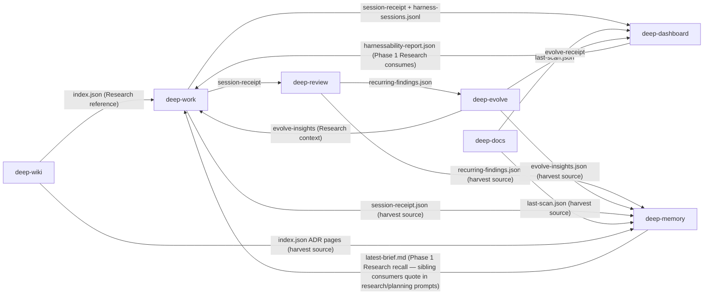

[한국어](./integrated-workflow-guide.ko.md)

# Deep Suite Integrated Workflow Guide

This guide explains how the 7 plugins in deep-suite's integrated artifact workflow **work together** during a real project across Claude Code and Codex. Rather than listing each plugin's features, it focuses on the integrated flow from a developer's perspective. (deep-goal and deep-loop are the suite's goal-compiler and loop-orchestration layers rather than participants in this artifact data-flow, so they are outside this guide's curated subset.)

> Reflects **deep-work v6.9.4**, **deep-review v1.13.0**, **deep-evolve v3.5.0**, **deep-docs v1.5.0**, **deep-wiki v1.7.1**, **deep-dashboard v1.5.0**, **deep-memory v1.0.2** — all 7 plugins adopt the M3 common artifact envelope (cross-plugin `run_id` chain + envelope-aware payload validation against the payload registry under `schemas/payload-registry/`). deep-dashboard v1.3.2 closes M5.5 acceptance — the final M4-deferred metric `suite.tests.coverage_per_plugin` is activated (per-plugin distribution against the 8-item M5.5 standard test catalog, sourced from a dashboard-internal manifest mirroring `docs/test-catalog.md`); all 16 metrics are now M4-core (12 M3-baseline + 3 M5-activated handoff/compaction + 1 M5.5-activated test coverage). deep-work v6.6.1 + deep-evolve v3.3.0 ship M5.7 producer-side adoption (handoff + compaction-state emit) closing the data-flow for the 3 M5-activated metrics (handoff roundtrip + compaction frequency/preserved-ratio); deep-work v6.6.2 closes M5.5 #7 with the non-implement dangerous-command denylist in `phase-guard-core.js` (5 families + `CLAUDE_ALLOW_<FAMILY>` overrides). M5.5 #3 hook golden tests (deep-work v6.6.3 + deep-evolve v3.3.1 + deep-wiki v1.5.1) and M5.5 #5 stale-recovery tests (deep-review v1.4.1 + deep-evolve v3.3.2 + deep-wiki v1.5.2) close the regression-protection gap for hook IO contracts and crash-recovery semantics, plus deep-work v6.6.3 ships the §9 phase-guard hardening rollup (override-env composition + per-family override loop + scope-omission docblock). deep-review v1.4.2 closed the M5.5 #5 ubuntu CI follow-up — reversing the BSD-first `stat -f %m` order in `mutation-protocol.sh` that returned a mount-point string on GNU stat and broke `set -e` arithmetic (mirrors the deep-work PR #27 BSD/GNU stat reverse-order pattern). deep-review v1.5.0 adds the `/deep-review-loop` wrapper (auto-iterates review ↔ respond with a main-agent termination policy: natural convergence / `--max` cap / stalled-signature ≥50% reappearance / operational errors ≥2 / user stop) and raises the Codex per-call timeout from 300s to 900s; `REVIEW_TIMEOUT_SECONDS` in `mutation-protocol.sh` bumps 600s → 1200s to keep orphan-lock detection past the new long-review ceiling. deep-review v1.5.1 ships a `plugin-dev`-audit-driven documentation-drift cleanup — agent frontmatter `whenToUse` collapsed into `description`, Phase 6 spec deduplication (35-line shell-logic block → 22-line invariant summary + single-source-of-truth table pointing to `commands/deep-review.md` Step 2.5), `phase6-delegation-spec.md` Status flipped Draft → Shipped (v1.3.3+, revised through v1.5.0), and Codex Mutation Protocol gains a `*왜 필요한가*` rationale paragraph; no runtime / command / hook protocol changes. deep-review v1.7.0 (= v1.6.1 + agy integration) promotes `/deep-review-loop` from a slash command into a `user-invocable: true` skill so the same §0–§9 review ↔ respond auto-iteration protocol is reachable from Codex / Copilot / Gemini CLI / Agent SDK clients (Claude Code parity preserved); v1.7.0 layers in optional 4-way synthesis when the agy CLI is detected (config `agy_enabled` + per-run sensitive-file fingerprint ack at Stage 3.5; AGY_EXCLUDE_FROM_SYNTHESIS gate for mutation / truncation / non-success). deep-docs v1.3.1 mirrored that pattern at the plugin-entry level — converted `/deep-docs` slash command into a `user-invocable: true` skill (cross-platform parity: Claude Code slash + Codex / Copilot CLI / Gemini CLI `Skill({skill: "deep-docs:deep-docs", args: "scan|garden|audit"})` invocation), with `verify-fixes.sh` retargeted to `skills/deep-docs/SKILL.md` (43 grep checks; two `allowed-tools` assertions correctly removed since skills have no `allowed-tools` frontmatter), plugin-dev validator round-2 PASS, and skill-reviewer PASS — this was the pilot of the suite-wide command→skill migration. deep-docs v1.4.1 extends the plugin from gardening to gardening + authoring — `/deep-docs scan` now also surfaces `missing-doc` / `thin-doc` gaps and `/deep-docs garden` can generate or restructure `CLAUDE.md` / `AGENTS.md` / `ARCHITECTURE.md`; the `last-scan` payload bumps `schema.version` 1.0 → 1.1 (additive `payload.gaps[]` + `summary.authoring` + `authoring` issue category), validated against the new `schemas/payload-registry/deep-docs/last-scan/v1.1.schema.json` under suite `--strict`. deep-evolve v3.4.3 lands the second installment of that migration — `/deep-evolve` promoted from slash command into a `user-invocable: true` skill at `skills/deep-evolve/SKILL.md` (Claude Code slash + Codex / Copilot CLI / Gemini CLI `Skill({skill: "deep-evolve:deep-evolve", args: "..."})` invocation), Step 0 / Step 0.5 / Step 1 / Protocol Routing Summary body bytes preserved verbatim so the 15 Python content-assertion pytest cases (`test_v31_routing.py`, `test_v31_kill_seed_cli.py`, `test_v31_cli_flags.py`) keep passing against the new path, 4-way manifest drift guard now at `3.4.1`, plugin-dev validator PASS (0/0/0) + skill-reviewer PASS. **v3.4.1 patch** trims `deep-evolve-workflow` skill description from 1137 → 905 chars to fit Codex's 1024-char skill description limit (Codex was silently dropping the workflow skill at load time on v3.4.0). **deep-wiki v1.7.1** ships the third installment of the suite-wide command→skill migration — all 5 `/wiki-*` slash commands (ingest / lint / query / rebuild / setup) promoted to `user-invocable: true` skills under `skills/wiki-{ingest,lint,query,rebuild,setup}/SKILL.md` for Codex / Copilot CLI / Gemini CLI / Agent SDK parity. deep-wiki is the largest single conversion in the suite (5 entry surfaces simultaneously; `wiki-ingest` alone is 2,841 body lines; 4,062 total) and the bodies are byte-equivalent to the prior `commands/wiki-*.md` (mechanical `cp` + `sed` retargeting of the ~20 cross-references in `agents/wiki-synthesizer-{analysis,inline}.md`, `hooks/scripts/{scan-vault-changes.sh,wrap-index-envelope.js}`, `skills/wiki-schema/{SKILL.md,wiki-schema.yaml}`, `tests/envelope-chain.test.js`, and `CLAUDE.md` / `README.md`); plugin-dev validator PASS (0/0/0) + skill-reviewer × 5 PASS + `npm test` 126/126 PASS. deep-work v6.7.1 completed the suite-wide command→skill migration — all 24 `/deep-*` slash commands (Category A: 7 thin `Skill()` wrappers absorbed by their matching skill bodies, no body change; Category B: 17 new `skills/deep-{verb}/SKILL.md` entry skills with frontmatter + `## Invocation` / `## Inputs (skill args)` / `## Prerequisites` head sections + byte-preserved bodies and only internal cross-ref retargeting) promoted to `user-invocable: true` for Codex / Copilot CLI / Gemini CLI / Agent SDK parity. deep-work is the largest single conversion in the suite (24 surfaces simultaneously vs deep-wiki's 5; `deep-finish` alone is 660 body lines + multiple `$ARGUMENTS` flag branches; `deep-status` is a hub that dispatches to 4 sub-skills via `${CLAUDE_PLUGIN_ROOT}/skills/deep-X/SKILL.md` inline Read). The 4-step suite-wide migration (deep-docs v1.3.1 pilot → deep-evolve v3.4.2 → deep-wiki v1.6.2 → deep-work v6.7.1) now closes cross-platform parity across the entire suite — every plugin's primary entry surfaces are reachable from non-Claude-Code clients. plugin-dev validator PASS (0/0/0) + skill-reviewer × 24 PASS + `npm test` 177/177 PASS + cross-OS CI (macos + ubuntu) green. deep-dashboard v1.4.0 moves Codex skill surfaces to `skills/<skill>/SKILL.md` so `deep-harnessability` and `deep-harness-dashboard` are discoverable from the Codex manifest; the dashboard also retains the catalog-drift horizon mechanism, cross-shell `npm test` glob portability, `.codex-plugin/plugin.json`, and Codex-facing `AGENTS.md` while preserving Claude Code manifests. deep-work v6.8.0 ships plan-quality contract enforcement (mandatory `failing_test` / `verification_cmd` / `expected_output` / `code_sketch` / `steps` per non-inline S/M/L slice; plan review-gate at `skills/shared/references/review-gate.md` aligned to the contract — v5.8 fallback removed), CI hardening (advisory `shellcheck` on `hooks/scripts/**/*.sh` with `continue-on-error: true`; test discovery widened to 6 subtree globs run sequentially via `--test-concurrency=1`; CI Node bumped 20 → 22 LTS to support the glob), and receipt-tracker robustness (pre-lock receipt init restored with `O_CREAT | O_EXCL` / `fs.writeFileSync` `flag: 'wx'` so single-write slices retain canonical `SLICE-NNN.json` on stale-lock timeout). Three new contract test files (`plan-quality-contract`, `ci-workflow-contract`, `file-tracker-lock-timeout`) pin the surfaces; `npm test` 901/901 pass; three iterative 3-way deep-review rounds (Claude Opus + Codex review + Codex adversarial) converged with APPROVE. deep-work v6.9.0 wires deep-work as a read-only consumer of the new `deep-memory` v0.1.0 plugin via two opt-in affordances — (1) Phase 1 Research recall: `skills/deep-research/SKILL.md` quotes `.deep-memory/latest-brief.md` verbatim under a new `## Cross-project Memory` section in `research.md` when the brief exists; absent → research artifact stays deep-memory-agnostic (privacy invariant — never auto-invoke, never write to artifact); provenance tokens (`mem-<ULID>` Crockford-base32 uppercase) captured into `cross_project_memory.cited_memory_ids[]` for the Phase 4+ feedback hook; (2) Phase 5 Integrate harvest: `skills/deep-integrate/SKILL.md` proposes `/deep-memory-harvest` in the top-3 LLM recommendations and the deterministic B-fallback list when `deep-memory ∈ plugins.installed` and the session changed > 0 files. `detect-plugins.sh` TARGETS extended (6 plugins) so the gate's `plugins.installed`/`plugins.missing` signal correctly enumerates deep-memory. Spec-of-record at `deep-work/docs/deep-memory-integration-handoff.md`; 12 fixture-based contract tests + 1 detect-plugins regression test pin every documented invariant; 3-round internal deep-review-loop converged to APPROVE; `npm test` 850/850 pass. deep-review v1.7.2 closes the two v1.7.1-deferred hybrid-mode coverage gaps. (1) Bilateral-wildcard `-ipath` directory-name matching — `build_find_expr` now emits a flat OR-chain `-iname X -o -ipath '*/*<inner>*'` for `*secret*` / `*password*` / `*token*` families so gitignored files like `./secrets/config.json` and `./token-store/value.txt` are detected (flat emission avoids the bash 3.2 `eval`-wrap subshell-token bug that nested `( )` would trigger). (2) `.deep-review/` runtime-state hashing — `capture_sensitive_hashes` appends a hardcoded snapshot of `config.yaml` + `.pending-mutation.json` via 4-arm dispatch (`[ -L ]` first → `non-regular` sentinel to block the symlink-to-arbitrary-file attack vector surfaced in spec round 5; `[ -f ]` regular → hash; `[ -e ]` non-regular non-symlink → sentinel; else → silent skip); `sort -o` in-place merges with the existing pipefail-guarded find pipeline. 7 new matrix tests (T-M16/16b/17/18/18b/19/20 — T-M16b is a pure unit test of `build_find_expr` output via awk-extract + eval since the bridge has no source-guard; T-M20 + T-M18b are negative regressions with `$OUT.status` assertion against bridge early-exit). CHANGELOG honestly documents partial coverage (non-bilateral families remain basename-only — `full-walk` workaround; `agy_fingerprint_mode` field unchanged) and a pre-existing-symlink known-limit (writes through a symlink to a target are not detected when the path was already a symlink before agy ran). Validated via 5-round spec + 5-round plan + 2-round impl `/deep-review-loop` (3-way Opus + Codex review + Codex adversarial each); spec/plan stayed staged-only per the v1.7.1 PR #21 pattern (no `docs/` paths in the merged PR). deep-review v1.8.0 (PR #23, merge `8da659e`) closes v1.7.2's two remaining "Known limitations (partial)" bullets via sidecar-driven dir-match opt-in + symlink arms 1a/1b/1c with bounded target snapshots — **minor bump** per handoff §2 Item 5 because default-on sidecar (`hooks/scripts/lib/sensitive-patterns-dir-match.list` shipping `credentials*` + `bearer_*`) expands hybrid-mode detection scope for existing user projects. New shared `_hash_path_with_symlink_handling` helper consolidates the 4+3-arm dispatch (1a inside-repo ≤16 KB target → `symlink:<sha>:<linkhex>`, 1b external/oversized → `symlink-unbounded:<linkhex>`, 1c readlink-failed → explicit sentinel; arms 2/3/4 preserved byte-for-byte from v1.7.2). Portable `_inside_project_root` via `PROJECT_ROOT_CANON=$(cd && pwd -P)` set once at bridge startup (resolves macOS `/tmp → /private/tmp` parent-symlink hazard). `_walk_hash` extended to `\( -type f -o -type l \)` with `LC_ALL=C sort | _sha256` for deterministic single-digest contract (T-M25b proves linkhex tracking under full-walk). `build_find_expr` split into `build_find_term <pat> <dm>` (new per-pattern) + `build_find_expr <list_file>` (signature preserved — v1.7.2 callers + legacy T-M16b unchanged). `_resolve_symlink` bounded at 40 iterations (Linux MAXSYMLINKS). Matrix **22 → 36** (14 new tests: T-M21/21b arm-1 distinguish, T-M22/23 sidecar +/-, T-M24/24-external G2 in-repo/external, T-M25/25-external/25b sensitive-scan + full-walk parity, T-M26/27 self-loop + >16KB cap). Backward-compat: T-M1..T-M20 invariant. Validated via 14 deep-review-loop rounds (spec 5 + plan 5 + impl 4); 🔴 trajectory 6→3→1→2→0 (spec) / 5→4→2→0→0 (plan) / 0 throughout (impl). `lib/sensitive-patterns.list` byte-identical for mutation-protocol.sh compatibility (C6). External symlink target content drift intentionally NOT detected per R5-C1 user decision Option A (T-M24-external + T-M25-external + T-M27 pin negative regressions). v1.8.1 backlog: full-walk per-file fork batching, capture_status_with_hashes symlink coverage, directory symlink recursion. deep-review v1.8.1 (PR #24, merge `a0f0963`) enforces read-only review for the agy reviewer: agy ran as a general-purpose agent with `--dangerously-skip-permissions` and a review prompt carrying no read-only directive, so it modified the workspace during Stage 3 before synthesis (the other three reviewers are structurally read-only). agy CLI has no read-only mode (pure `agy -p` and `--sandbox` both allow file writes), so `run-agy-reviewer.sh` now prepends a strict read-only preamble at a single bridge choke point (body limit 200KB→198KB for argv headroom); the pre/post worktree fingerprint stays as the defense-in-depth backstop (mutation → `AGY_STATUS=mutated` → excluded from N-way synthesis). New Test 1b + full 36-case bridge matrix + envelope/mutation-protocol/phase6/detect-environment all green.

See `docs/envelope-migration.md` for envelope schema + migration guide.

---

## Runtime Invocation Model

Deep Suite keeps the historical `claude-deep-suite` marketplace key and `claude-deep-*` plugin repository names for compatibility. Runtime exposure is now dual-surface:

| Runtime | Marketplace surface | Invocation style |
|---------|---------------------|------------------|
| Claude Code | `.claude-plugin/marketplace.json` | Slash commands such as `/deep-work`, `/wiki-ingest`, `/deep-docs scan` |
| Codex | `.agents/plugins/marketplace.json` + each plugin's `.codex-plugin/plugin.json` | Skill aliases such as `$deep-work:deep-work`, `$deep-wiki:wiki-ingest`, `$deep-docs:deep-docs scan` |

Most scenario snippets below use the Claude Code slash-command form because it is shorter. In Codex, use the matching skill alias from the entry-point table; the protocol and artifact flow are the same unless a section explicitly discusses Claude Code hooks.

---

## Plugin Roles at a Glance

```
Development Lifecycle:

  Plan          →      Build        →      Verify       →      Integrate      →    Finish
  ───────────────────────────────────────────────────────────────────────────────────────
  deep-work           deep-work           deep-review       deep-work              deep-work
  (Research            (Implement          (independent      (Phase 5:              (/deep-finish)
   + Plan)              + Test)             review)           AI recommends
                       deep-evolve         deep-dashboard    next step)
                       (autonomous         (harness
                        optimization)       diagnostics)
                                           deep-wiki
                                           (knowledge
                                            accumulation)
```

| Plugin | Core Question | When to Use | Claude Code | Codex |
|--------|--------------|-------------|-------------|-------|
| **deep-work** | "How do I design and implement this?" | Every code task — features, bugs, refactors | `/deep-work <task>` | `$deep-work:deep-work <task>` |
| **deep-evolve** | "Can I automatically make this better?" | Performance optimization, test improvement, code quality | `/deep-evolve` | `$deep-evolve:deep-evolve` |
| **deep-review** | "Is this code actually good?" | Pre-PR independent verification | `/deep-review-loop` | `$deep-review:deep-review-loop` |
| **deep-docs** | "Do docs match the code?" | Post-change documentation sync | `/deep-docs scan` | `$deep-docs:deep-docs scan` |
| **deep-wiki** | "How do I preserve what I learned?" | Knowledge accumulation across sessions | `/wiki-ingest <source>` | `$deep-wiki:wiki-ingest <source>` |
| **deep-dashboard** | "Is the harness working well?" | Project health diagnosis, improvement areas | `/deep-harness-dashboard` | `$deep-dashboard:deep-harness-dashboard` |

**Note on commands vs skills** — `/deep-harnessability` and `/deep-harness-dashboard` are exposed as plugin **skills** (not top-level commands). Claude Code invokes them via the slash-command interface just like commands; Codex invokes them as `$deep-dashboard:deep-harnessability` and `$deep-dashboard:deep-harness-dashboard`. Internally they live under `deep-dashboard/skills/<skill>/SKILL.md`.

---

## Scenario 1: New Feature Development (Full Flow)

### Example: "Add JWT authentication middleware to Express API"

#### Step 1: Analyze, plan, build with deep-work

```bash
/deep-work "Add JWT-based user authentication middleware"
```

deep-work automatically runs the **6-phase** workflow (v6.3.0):

1. **Brainstorm** (skippable) — Why JWT? Session vs JWT tradeoffs. Clarify requirements with the user.
2. **Research** — Deep codebase analysis. Existing middleware patterns, routing structure, test infrastructure, dependencies.
3. **Plan** — Slice-based implementation plan with file-by-file changes, test strategy, ordering. **User approval required.**
4. **Implement** — TDD-enforced per-slice execution. RED (failing test) → GREEN (minimal code) → REFACTOR.
5. **Test** — Full verification: coverage, type checking, linting, Sensor Clean, Mutation Score, Slice Review.
6. **Integrate** *(skippable, new in v6.3.0)* — reads installed deep-suite plugin artifacts and proposes the top-3 next actions (see Scenario 5).

Cross-plugin context is automatically consumed during Research:

- If **`.deep-dashboard/harnessability-report.json`** exists — Research includes hints like "Type Safety 3.2/10 — consider enabling `tsconfig` strict mode".
- If **`.deep-evolve/<session-id>/evolve-insights.json`** exists — Research references prior project insights like "guard-clause pattern was effective here previously".

```
Slice 1: auth middleware skeleton
  → Write test → Verify failure → Implement → Tests pass → Slice Review → Commit

Slice 2: JWT verification logic
  → Write test → ... → Commit

Slice 3: Route protection
  → Write test → ... → Commit
```

#### Step 2: Phase 5 Integrate (or skip)

When Phase 4 (Test) completes, deep-work asks:

```
Phase 5 Integrate — proceed, or skip to /deep-finish?
  [proceed] Read plugin artifacts and get AI recommendations
  [skip]    Go straight to /deep-finish (pass --skip-integrate)
```

Choosing `proceed` triggers the recommendation loop (Scenario 5). Choosing `skip` preserves the legacy `/deep-finish` flow; you can still re-enter later with `/deep-integrate`.

#### Step 3: Independent review with deep-review (typically chosen by Phase 5)

```bash
/deep-review
```

deep-review runs an independent Claude reviewer over the full diff. Claude Code uses its Agent tool path; Codex and other non-Claude clients use the Claude CLI reviewer bridge:

- **Stage 1** — Detect git state (clean/staged/unstaged).
- **Stage 2** — Load project rules (`.deep-review/rules.yaml`).
- **Stage 3** — Claude reviewer reviews the diff (optionally 3-way cross-verification when Codex plugin is installed).
- **Stage 4** — Verdict: APPROVE / CONCERN / REQUEST_CHANGES.
- **Stage 5.5** *(only once 2+ review reports exist)* — Aggregates recurring patterns across historical reports into `.deep-review/recurring-findings.json`. The next deep-evolve session reads this file to steer experiment direction.

deep-review also writes `.deep-review/fitness.json` for architecture fitness rules consumed by later reviews and the dashboard.

#### Step 4: Sync docs with deep-docs

```bash
/deep-docs scan
```

Scans CLAUDE.md, README, API docs for drift from code. Auto-fixable items are repaired with `/deep-docs garden`. The scan writes `.deep-docs/last-scan.json` (includes HEAD SHA + branch) for deep-dashboard to consume.

#### Step 5: Accumulate knowledge with deep-wiki

```bash
/wiki-ingest .deep-work/<session-dir>/report.md
# or pass the whole session folder — the ingest picks up report.md automatically
/wiki-ingest .deep-work/<session-dir>/
```

Ingests the deep-work session report into the wiki. Patterns, decisions, and tradeoffs from the JWT implementation are permanently preserved.

> `/wiki-ingest` accepts a URL, a file path, or a deep-work session folder. It does **not** accept `session-receipt.json` directly — pass `report.md` or the session directory.

#### Step 6: Close the session

```bash
/deep-finish
```

The standard 4-option finish menu (merge / PR / keep / discard) runs unchanged.

---

## Scenario 2: Performance Optimization (deep-evolve focused)

### Example: "Automatically minimize ML model val_bpb"

#### Step 1: Start a deep-evolve session

```bash
/deep-evolve
```

deep-evolve creates a new session directory `.deep-evolve/<session-id>/` and records `session_id` in `.deep-evolve/current.json`. Inside the session root it generates:

- `prepare.py` (or `prepare-protocol.md` for MCP/tool-based evaluation)
- `program.md` (experiment instructions)
- `strategy.yaml` (strategy parameters)
- `runs/`, `code-archive/` sub-directories

Cross-plugin data is utilized automatically:

- If `.deep-review/recurring-findings.json` exists → Stage 3.5 reads it to bias `prepare.py` scenario weights and injects a "known recurring defects" section into `program.md`.
- If the meta-archive has a similar project → transfers validated `strategy.yaml` initial values.

#### Step 2: Autonomous experiment loop

```
Inner Loop (code evolution, v3 flow):
  Idea ensemble (3 candidates) → Category tagging (1.5, v3) → Select 1
  → Code modification → Commit → Evaluate → Delta measurement (4.5, v3)
  → Diagnose gate (5.a, v3; crash/severe-drop → 1 retry)
  → Score compare → Shortcut detector (5.c, v3; flag tiny-change + big-jump)
  → Legibility gate (5.d, v3; rationale required on keep)
  → Persist: Keep / Discard / Hard-reject-flagged → Repeat (20 rounds)

  Step 6.a.5 (v3): 3 cumulative flagged keeps → force Section D prepare expansion
  with adversarial scenarios derived from flagged commits' diffs.

Outer Loop (strategy evolution):
  20 Inner Loop rounds → Meta Analysis → Adjust strategy.yaml (with entropy overlay, v3)
  → Compute Q(v) → Strategy improved? Keep : Restore previous strategy
  → Stagnation OR flagged density? Tier 3 prepare expansion with flagged evidence injection (v3)
  → Epoch transition → Resume Inner Loop
```

**v3 silent-failure defenses**: entropy_snapshot event per generation catches
exploration collapse; shortcut detector + forced Section D prevent the agent
from passing adversarial harness via score-vs-LOC heuristic; diagnose-retry
recovers ideas whose only problem was environment/hyperparameter; legibility
gate (`session.legibility.missing_rationale_count`) surfaces unexplainable keeps.

#### Step 3: Completion & cross-plugin integration

When experiments complete, deep-evolve writes into the **session root**:

1. `.deep-evolve/<session-id>/evolve-receipt.json` — deep-dashboard collects it. In v3 the receipt carries the session's actual `deep_evolve_version` (previously hardcoded `"2.2.2"`).
2. `.deep-evolve/<session-id>/evolve-insights.json` — surfaced to the next deep-work Research phase.
3. **v3 Signals section** in the final report (only on v3 sessions): idea entropy trajectory, shortcut flagged count, hard-rejected (`flagged_unexplained`) keeps, diagnose-retry usage, rationale missing count, Section D forced triggers, Tier 3 flagged-trigger fires.
4. Completion menu (6 options):
   - "deep-review then merge" — independent verification before auto-merge
   - "deep-review then create PR" — independent verification before PR
   - "merge to main" / "create PR" / "keep branch" / "discard"

---

## Scenario 3: Project Health Diagnosis

### Example: "Understand overall project state and identify improvement areas"

#### Step 1: Harnessability diagnosis

```bash
/deep-harnessability
```

Automatically analyzes 6 dimensions:

- Type Safety, Module Boundaries, Test Infrastructure, Sensor Readiness, Linter & Formatter, CI/CD
- Each scored 0-10 by computational detectors
- Results saved to `.deep-dashboard/harnessability-report.json`

#### Step 2: Unified dashboard

```bash
/deep-harness-dashboard
```

Aggregates data from all plugins into a single effectiveness score:

```
+------------------------------------------------------+
|  Deep-Suite Harness Dashboard                        |
+------------------------------------------------------+
|  Topology: nextjs-app  Harnessability: 7.4/10 Good   |
+------------------------------------------------------+
|  Health Status                                       |
|  dead-export        clean                            |
|  dependency-vuln    ! 2 critical (npm audit)         |
+------------------------------------------------------+
|  Evolve                                              |
|  Experiments   80 (keep: 25%, crash: 6%)             |
|  Quality       78/100                                |
+------------------------------------------------------+
|  Effectiveness: 7.1/10                               |
+------------------------------------------------------+
|  Suggested actions                                   |
|  - npm audit fix (2 critical vulnerabilities)        |
|  - Review strategy.yaml - Q(v) declining             |
+------------------------------------------------------+
```

**5-dimension weighted score**: health(0.25) + fitness(0.20) + session(0.20) + harnessability(0.15) + evolve(0.20)

#### Step 3: Act on suggestions

Follow the dashboard's recommended actions using other plugins:

- "npm audit fix" → run directly
- "Run /deep-evolve with meta analysis" → `/deep-evolve`
- "Add tests in next deep-work session" → `/deep-work "improve test coverage"`

---

## Scenario 4: Knowledge Accumulation & Reuse

### Example: "Permanently preserve technical documents, session results, and external resources"

#### Accumulate external knowledge

```bash
# URL
/wiki-ingest https://martinfowler.com/articles/harness-engineering.html

# Local file
/wiki-ingest docs/architecture-decision.md

# deep-work session folder — picks up report.md automatically
/wiki-ingest .deep-work/<session-dir>/

# Or point directly at report.md
/wiki-ingest .deep-work/<session-dir>/report.md
```

The wiki creates/updates pages per source. **Pages accumulate knowledge** as more sources land on the same topic (accumulation principle).

#### Search & leverage knowledge

```bash
/wiki-query "What are the pros and cons of refresh token rotation in JWT auth?"
```

Generates answers grounded in wiki content with inline citations. When cross-page insights emerge from 2+ pages, a synthesis page is automatically created and filed back into the wiki.

#### Wiki health management

```bash
/wiki-lint
```

Detects contradictions, broken links, stale content, and orphan pages.

---

## Scenario 5: Phase 5 Integrate — AI Recommendation Loop

*(new in deep-work v6.3.0)*

### Purpose

After a deep-work session completes (Phase 4 Test), you often face the decision *"what should I run next?"* — `/deep-review`? `/deep-docs`? `/wiki-ingest`? `/deep-harness-dashboard`? Phase 5 Integrate reads the artifacts that installed deep-suite plugins have already produced and lets an LLM rank the top-3 next actions with rationale.

### How to enter

**Automatic (recommended):** After Phase 4, deep-work asks whether to proceed into Phase 5. Choose `proceed`.

**Skip at entry:** Pass `--skip-integrate`:

```bash
/deep-work --skip-integrate "<task>"
```

**Manual re-entry:** Even after skipping, you can call Phase 5 from an active session at any time:

```bash
/deep-integrate
```

Requires an active deep-work session with Phase 4 complete. Without one, the command exits with an error.

### UX — top-3 loop

Phase 5 repeatedly:

1. **Gathers signals** from `$WORK_DIR/session-receipt.json`, `.deep-review/recurring-findings.json`, `.deep-review/fitness.json`, `.deep-dashboard/harnessability-report.json`, `.deep-docs/last-scan.json`, `.deep-evolve/<session-id>/evolve-insights.json`, `<wiki_root>/.wiki-meta/index.json`, and `git diff`. Missing files are read as `null` (fail-safe).
2. **Asks the LLM** to rank the top-3 next actions with a rationale and the signals used.
3. **Renders** the top-3 plus `[skip] [finish]`.
4. **You pick** one; the selected command runs; the plugin updates its own artifacts.
5. **Loop** with the updated signals — up to **5 rounds**.

### Loop state file

Phase 5 writes incrementally to `$WORK_DIR/integrate-loop.json` — one entry per round (plugin, command, outcome, timestamp) plus the last recommendations cached for re-display. On Ctrl-C or session interruption, the Stop-hook records `terminated_by: "interrupted"` so the next `/deep-integrate` can offer "resume / restart / skip".

### Termination conditions

| Reason | Meaning |
|--------|---------|
| `user-finish` | User selected "finish" |
| `max-rounds` | 5-round hard cap reached |
| `no-more-recommendations` | LLM returned empty `recommendations[]` |
| `interrupted` | Ctrl-C or session end |
| `error` | LLM/tool failure after retry (Phase 5 is closed via `--skip-integrate` fallback) |

### Typical recommendation examples

| Signal | Top-3 likely |
|--------|--------------|
| `files_changed > 0` + docs changed | deep-docs scan, deep-review, wiki-ingest |
| `weakest_dimension="documentation"` in dashboard | deep-docs scan, deep-harness-dashboard, wiki-ingest |
| `recurring-findings.json` has 3+ findings, deep-evolve missing | Install deep-evolve *(installation suggestion, not a direct action)* |
| `files_changed=0` | Single lightweight action + `finish_recommended: true` |

### What changes in deep-finish

`/deep-finish` now hints `/deep-integrate` if no `integrate-loop.json` exists for the current session. You can ignore the hint and proceed; it is non-blocking.

---

## Cross-Plugin Data Flow

<!-- deep-suite:auto-generated:data-flow-en:start -->



<!-- deep-suite:auto-generated:data-flow-en:end -->

> The diagram above is regenerated from `.claude-plugin/suite-extensions.json` `data_flow[]`. It is **non-authoritative** — intent only. Machine-readable cross-plugin truth lives in M3 envelope (`run_id` / `parent_run_id`). Phase 5 reads ALL of the above + git signals → AI ranks next action (loop).

Absolute path reference:

| Artifact | Location |
|----------|----------|
| deep-work receipts | `$WORK_DIR/session-receipt.json`, `$WORK_DIR/receipts/SLICE-*.json` |
| deep-work report | `$WORK_DIR/report.md` (`$WORK_DIR = .deep-work/<YYYYMMDD-HHMMSS-slug>/`) |
| deep-work Phase 5 loop | `$WORK_DIR/integrate-loop.json` |
| deep-review findings | `.deep-review/recurring-findings.json` (Stage 5.5, needs 2+ reports) |
| deep-review fitness | `.deep-review/fitness.json` |
| deep-review reports | `.deep-review/reports/<timestamp>-review.md` |
| deep-docs scan | `.deep-docs/last-scan.json` |
| deep-dashboard | `.deep-dashboard/harnessability-report.json` |
| deep-evolve pointer | `.deep-evolve/current.json` (`session_id`) |
| deep-evolve session | `.deep-evolve/<session-id>/evolve-receipt.json`, `.deep-evolve/<session-id>/evolve-insights.json` |
| deep-wiki index | `<wiki_root>/.wiki-meta/index.json` |

Each plugin operates **independently** and communicates via JSON files. Missing plugins degrade gracefully — Phase 5 treats absent artifacts as `null` and just narrows its recommendation pool.

---

## Usage Guide by Complexity

### Quick bug fix (~30 min)

```bash
/deep-work --skip-integrate "fix login 500 error"
# → Research → Plan → Implement (TDD) → Test → /deep-finish
# Optional: /deep-review before commit if the fix touches critical code
```

deep-work alone is sufficient. Skip Phase 5 for trivial changes.

### Medium feature (2-4 hours)

```bash
/deep-work "add Stripe payment integration"
# → Full 6-phase (Brainstorm → ... → Test → Integrate)
# Phase 5 usually recommends:
#   1. /deep-review     (new code path, payment = critical)
#   2. /deep-docs scan  (docs likely touched)
#   3. /wiki-ingest     (preserve the decision rationale)
# → /deep-finish
```

deep-work + deep-review + deep-docs + wiki-ingest, coordinated via Phase 5.

### Large-scale optimization (half-day+)

```bash
# 1. Diagnose current state
/deep-harness-dashboard

# 2. Autonomous optimization
/deep-evolve "achieve 90% test coverage"
# → dozens of experiments, session at .deep-evolve/<session-id>/

# 3. Verify results
# → at completion menu, select "deep-review then merge"

# 4. Accumulate learnings
/wiki-ingest .deep-evolve/<session-id>/    # session folder works directly
```

Full plugin stack. Dashboard for diagnosis → Evolve for autonomous improvement → Review for verification → Wiki for accumulation.

### Phase 5 ad-hoc consultation

```bash
# During an existing deep-work session that skipped Phase 5
/deep-integrate
```

Gets an AI recommendation for the current snapshot of artifacts — useful when you're mid-session and wondering which plugin to call next.

---

## Tips

1. **Let Phase 5 drive the suite** — the integrated recommender already knows which artifacts exist and what the latest diff looks like. Override its top-3 only when you have a specific reason.

2. **Run deep-review before PRs** — an independent Claude reviewer catches what self-review misses. Install the Codex plugin for 3-way cross-verification; Codex invokes Claude through the reviewer bridge.

3. **Use deep-evolve with measurable goals** — "make the code better" is too vague. "Minimize `val_bpb`" or "100% pass rate on scenario suite" gives the agent a clear target.

4. **Run /deep-harness-dashboard weekly** — trend tracking exposes regressions in harness effectiveness before they compound.

5. **Accumulate everything in deep-wiki** — today's struggle is tomorrow's asset. Session reports, external docs, and technical decisions in the wiki compound over time. Phase 5 will surface wiki-ingest as a top recommendation when it sees a session report that has not yet been archived.
