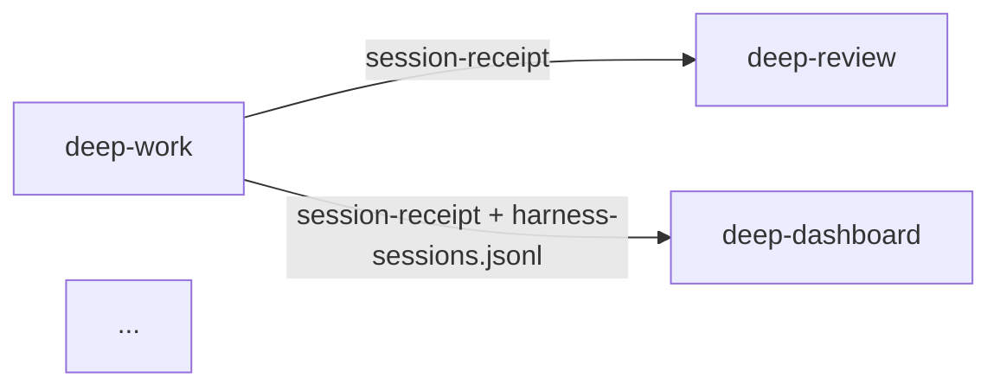

# Data-flow mermaid template

The generator emits a Mermaid `flowchart` derived from `.claude-plugin/suite-extensions.json` `data_flow[]`:

Edge labels come from `data_flow[*].via` (display-only, per `schemas/README.md`). The graph is **non-authoritative** — it captures intent, not every cross-plugin read. machine-readable cross-plugin truth lives in M3 envelope (`run_id` / `parent_run_id`).

Locale variants share the same diagram (mermaid is language-neutral). Surrounding narrative (Korean vs English) is hand-curated outside the markers.

This file is documentation only — the generator does not read it. The contract lives in `scripts/generate-reference-sections.js` (`renderDataFlow()`).
